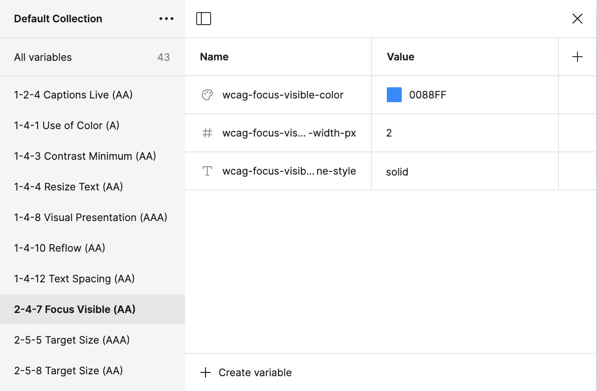

# WCAG Tokens

Explore a curated collection of design tokens crafted to comply with the **[Web Content Accessibility Guidelines (WCAG)](https://www.w3.org/WAI/standards-guidelines/wcag/)**. These tokens support accessibility across various design elements such as size, spacing, color, typography, and more. 


*Screenshot of a Figma Variables collection displaying the imported WCAG tokens.*

We aim to offer a comprehensive set of **utility tokens**, guidelines, examples, and best practices to assist designers and developers in integrating these accessibility-focused tokens into their existing design systems, ensuring consistent and accessible digital interfaces.

## About this community

Our mission is to enhance digital accessibility by providing a robust and standardized set of design tokens aligned with the Web Content Accessibility Guidelines (WCAG).

We empower designers and developers to seamlessly integrate these tokens into existing design systems, ensuring that digital products are accessible to all users, including those with disabilities.

## Figma Plugin Overview
The WCAG Tokens Figma plugin is designed to enhance the accessibility of digital designs by integrating WCAG guidelines directly into the design process. The plugin provides several key features to support designers and accessibility specialists:

### Tokens:

- **Utility Tokens** – Import accessibility utility tokens as Figma variables. These tokens help ensure accessible design decisions across various design elements, such as size, spacing, color, typography, and timing.

### Search:

- **Guideline Search** – Search for specific WCAG criteria within the Figma design environment. This feature allows designers to find and apply relevant guidelines quickly, ensuring their designs comply with accessibility standards.

### Cards:

- **Notation Cards** – Annotate Figma design files with WCAG guideline cards. These cards provide quick references and educational support for design teams, increasing their knowledge of accessibility requirements and best practices.


## Creating WCAG Design Tokens

Our initiative focuses on creating design tokens that can be used in design systems to meet different WCAG success criteria. It focuses on key areas like size, spacing, color, typography, and more. 

This provides a clear method for designers and developers to make sure all digital content follows accessibility standards. 

These tokens act as helpful tools that allow design teams to consistently apply accessibility throughout their projects, ensuring their work is inclusive and meets global accessibility guidelines.

## WCAG Token Set
Below is a comprehensive list of the key WCAG criteria that our utility tokens will address:

### Size and Spacing

- **1.4.12 Text Spacing**
  - Modify text spacing (line height, paragraph spacing, letter spacing, word spacing) without loss of content or functionality.

### Colors

- **1.4.1 Use of Color**
  - Color is not the sole means of conveying information, initiating action, or distinguishing a visual element.
- **1.4.3 Contrast (Minimum)**
  - Minimum contrast ratio of 4.5:1 for normal text and 3:1 for large text.
- **1.4.6 Contrast (Enhanced)**
  - Higher contrast ratio of 7:1 for normal text and 4.5:1 for large text.
- **1.4.11 Non-text Contrast**
  - Visual presentation of UI components and graphical objects must have a contrast ratio of at least 3:1.

### Typography

- **1.4.4 Resize Text**
  - Text can be resized up to 200% without loss of content or functionality.
- **1.4.8 Visual Presentation**
  - Control over foreground and background color, width of text blocks, and line spacing.

### Timing Units

- **2.2.1 Timing Adjustable**
  - Ability to turn off, adjust, or extend time limits unless required by the content.
- **2.2.2 Pause, Stop, Hide**
  - Control over moving, blinking, scrolling, or auto-updating information.

### Target Size

- **2.5.5 Target Size (Minimum)**
  - Target for pointer inputs is at least 44 by 44 CSS pixels, except under certain conditions.

### Additional Interaction and Layout

- **1.4.10 Reflow**
  - Content can reflow without loss of information or functionality, not requiring scrolling in two dimensions at specific dimensions.
- **1.4.13 Content on Hover or Focus**
  - Additional content triggered by hover or keyboard focus is dismissible, hoverable, and persistent.
- **2.4.7 Focus Visible**
  - Keyboard focus indicator must be visible.
- **2.5.3 Label in Name**
  - Text labels must match the visual presentation for interactive elements.

## Example

The JSON file below offers an example of the template we are using for a collection of design tokens designed to align with the Web Content Accessibility Guidelines (WCAG):

```json
  "wcag-focus-visible-color": {
    "$type": "color",
    "$value": "#0088ff",
    "$description": "WCAG 2.4.7 (AA v2.0) - Color for focus indicators that ensures high visibility when elements receive focus."
  },
  "wcag-focus-visible-outline-width-px": {
    "$type": "number",
    "$value": "2",
    "$description": "WCAG 2.4.7 (AA v2.0) - Width of the outline used for focus indicators to ensure visibility."
  },
  "wcag-focus-visible-outline-style": {
    "$type": "string",
    "$value": "solid",
    "$description": "WCAG 2.4.7 (AA v2.0) - Style of the outline used for focus indicators (e.g., solid, dashed)."
  },

```

## Next Steps and Contributing to the Repository

### What's Next?

As we continue to refine and expand our repository, our goal is to ensure our design tokens not only meet current WCAG guidelines but also anticipate future accessibility needs. Here are the next steps we plan to take:

#### Additional Tokens and Categories

- **Additional Tokens**: Keep tokens up-to-date with the latest accessibility standards and design trends.
- **Expanding Token Categories**: Introduce additional tokens that cover more aspects of accessibility, including auditory and cognitive dimensions.

#### Enhancements in Documentation

- **Enhancing Documentation**: Provide more detailed documentation and examples to make the integration process as straightforward as possible.
- **Educational Resources**:
  - **Inline Guidance**: Include brief explanations or links to more detailed resources about WCAG guidelines within the plugin. This helps users understand the importance of certain tokens.
  - **Examples and Best Practices**: Offer examples of best practices for implementing the tokens in designs, helping users see practical applications.

#### Improved Search Functionality

- **Autocomplete and Suggestions**: Implement autocomplete functionality to suggest guidelines as users type. This can be based on partial matches or related criteria.
- **Advanced Filters**: Allow users to filter search results by WCAG level (A, AA, AAA), guideline category, or by specific keywords related to their needs.

#### Import Tokens Improvements

- **Preview Changes**: Allow users to preview the visual changes the tokens will bring to the design before importing them. This can help them make more informed decisions.

#### Design Token Management

- **Grouping and Categorization**: Enable users to group and categorize tokens by guideline category or by the design element they impact (e.g., color, spacing, typography).
- **Customization**: Allow users to customize imported tokens if needed and save these customizations within the plugin for future use.

#### User Interface Enhancements

- **Visual Feedback**: Provide visual feedback for actions such as successful imports, errors, or when a search yields no results.

#### User Interaction and Customization

- **Save Searches and Preferences**: Allow users to save their search queries and preferences for quicker access in future sessions.
- **Favorite Tokens**: Enable users to mark certain tokens as favorites for easy access.

#### Accessibility Features in the Plugin

- **Keyboard Navigation**: Ensure the plugin itself is fully navigable using a keyboard.
- **Screen Reader Compatibility**: Make sure the plugin is compatible with screen readers to support all users, including those with disabilities.

By focusing on these areas, we aim to make our plugin an invaluable tool for designers committed to creating accessible digital content. If you have any suggestions or comments, please send us a note via the [Issues](https://github.com/mpaiva/wcag-tokens/issues) page.


### How You Can Contribute

We warmly invite contributions from the community! Whether you're a designer, developer, accessibility expert, or just passionate about making the web more accessible, your input is valuable. Here’s how you can get involved:

- **Submit Token Ideas**: If you have ideas for new tokens or improvements to existing ones, please share them with us.
- **Report Issues**: If you find any issues or inconsistencies in the current tokens, let us know through the repository's [Issues](https://github.com/mpaiva/wcag-tokens/issues) section.
- **Improve Documentation**: Help us make our documentation clearer and more comprehensive to assist others in using and understanding our tokens.
- **Spread the Word**: Share the repository with others who might find it useful or could contribute to its growth.

Together, we can build a more accessible digital world, one design token at a time!

## How to Make a Contribution

### Fork the Repository:

- Start by forking the repository to your GitHub account.

### Create a Branch:

- Create a branch in your forked repository. This keeps your changes organized and separate from the main branch.

### Make Your Changes:

- Make the necessary changes or additions to your branch. Ensure that your changes adhere to the existing coding and documentation standards.

### Submit a Pull Request:

- Once you have completed your changes, submit a pull request to the main repository. Please provide a comprehensive description of what changes you have made and why.

### Respond to Feedback:

- Once your pull request is reviewed, there may be feedback. Responding promptly and making any required updates is crucial in the review process.

## Code of Conduct

- Be respectful of all contributors.
- Engage constructively during disagreements.

By following these simple guidelines, you will help us maintain the quality and efficacy of our design tokens. We look forward to your contributions and thank you for helping us make the web a more accessible place for everyone!

## Questions?

If you have any questions about contributing, please feel free to contact us via the repository's [Issues](https://github.com/mpaiva/wcag-tokens/issues) section or directly through our community communication channels.